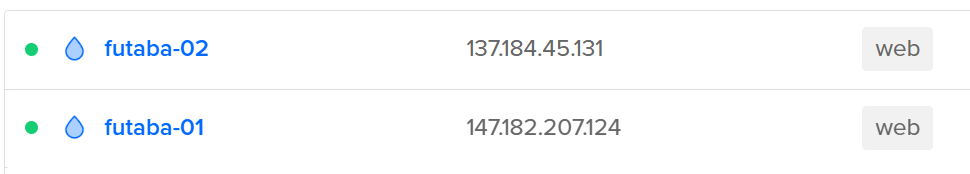
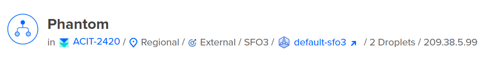

# Assignment 3 Part 2 for ACIT 2420

## Tasks
### Task 1: Create 2 New Digital Ocean Droplets running Arch Linux with the tag "web"

You will use this tag when you setup your load balancer.

It should look something like this:  


### Within you droplet, do the following:
1. Update your system by running the following command:
    ```
    sudo pacman -Syu
    ```
    This will update your system and make sure you have the latest packages.
2. Install the following packages:
    * nginx
    * nvim
    * git
    * ufw
    ```
    sudo pacman -S nginx nvim git ufw
    ```
### Task 2: Create a load balancer
The load balancer should be public facing and balance traffic between the two droplets you created in Task 1.

Settings for the load balancer:
* Regional, SFO3, same as your servers
* Default VPC, same as your servers
* External(public)
* Use the "web" tag to load balance all servers with a web tag in the SF03 region

It should look something like this:  


### Task 3: Clone the starter code

Clone the starter code from the following repository:
https://git.sr.ht/~nathan_climbs/2420-as3-p2-start

This can be done by running the following command on your terminal:

```
git clone https://git.sr.ht/~nathan_climbs/2420-as3-p2-start
```

This contains a script that will generate an HTML document.

>[!NOTE] 
>Alternatively, you can run the setup script. It will setup the necessary nginx configurations for the server and clone the repository for you.

### Task 4: Update your server configuration to include a file server. 

When you visit 'your-ip/documents' you will see a list of the documents in the documents directory.

The directory structure should look like this:
```
├── bin/
│   └── generate_index
├── documents/
│   ├── file-one
│   └── file-two
└── HTML/
    └── index.html
```

**Some notes:**
* index.html is still generated by generate_index
* file-one and file-two are just sample files
  * they should contain some text so that you can confirm that you can download from your file server

Both Servers should have the following features:
* updated script to generate an updated HTML document
* file server that will serve some test files on both servers.


## FOR THE VIDEO
why do we make a system user?
- goal is to isolate the resources from other users
- make a system user and give ownership to the file server then this will ensure that other users can not access the files or make changes to it
- the system user does not have a login beacause this will make sure that no one can log in and change the files 

Why do we make a service file?

What is a after? wants? in a service file 
what is a target? 
- a target is a unit that is used to group other units together
- group of service file that achieves a specific state after it has been started

What is a timer?
- a unit that activates and deactivates other units based on a schedule
What is OnCalendar? 
What is WantedBy?
How does this timer know what service to start?